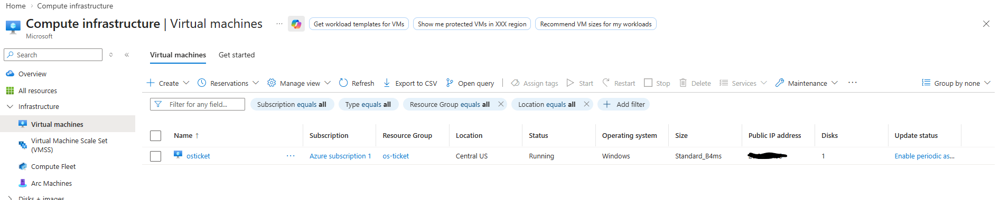
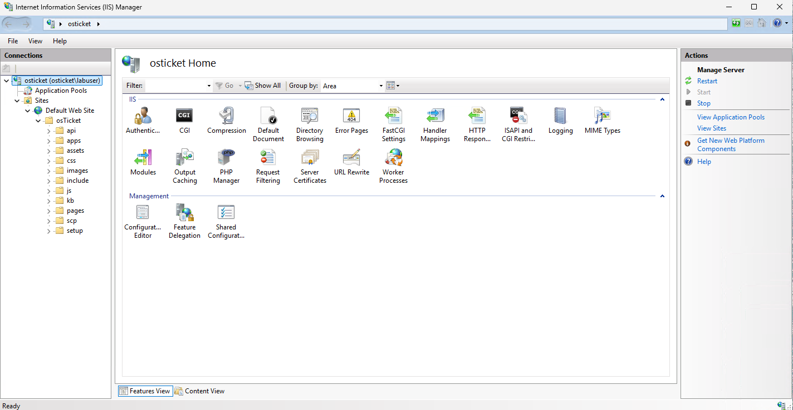
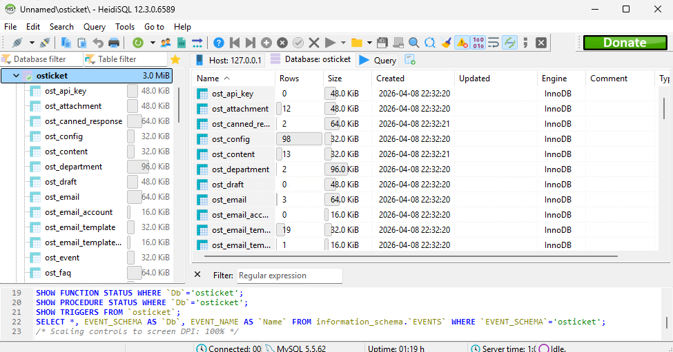
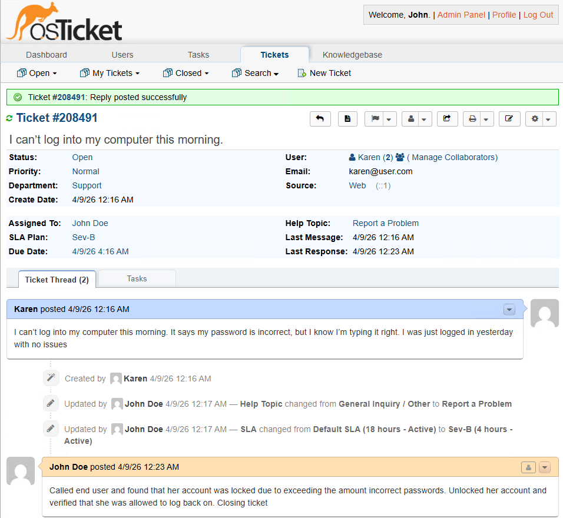
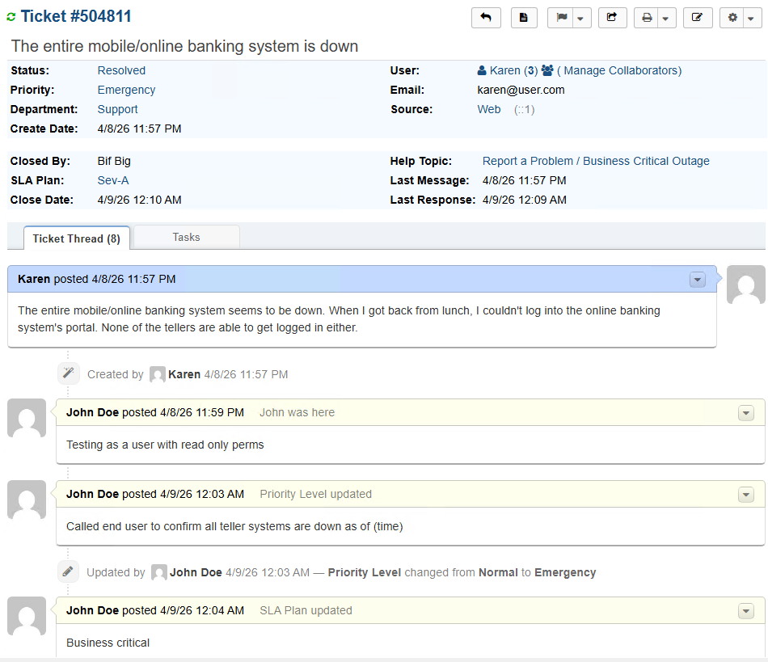
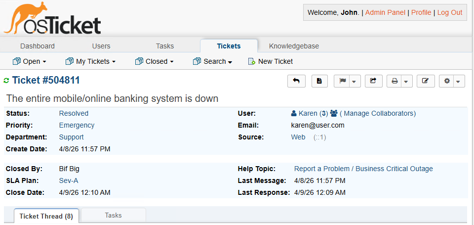
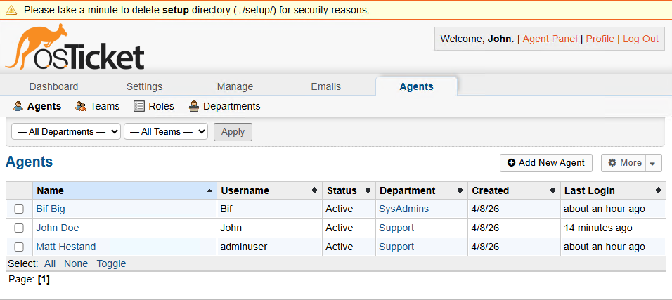
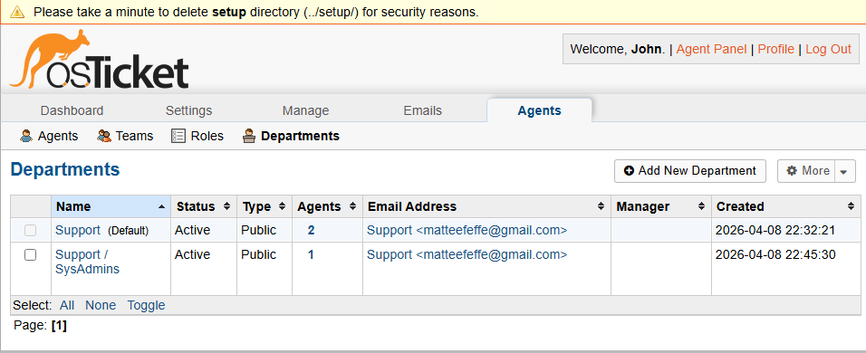
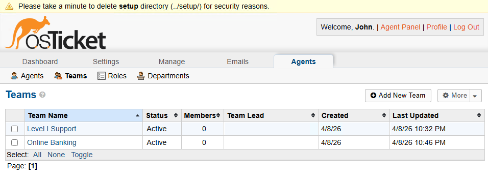

# osTicket Lab – Help Desk Ticketing System

## Overview
In this lab, I deployed and configured an osTicket help desk system in a Windows environment using IIS, PHP, and MySQL.

This project simulates real-world IT support operations, including ticket intake, user management, SLA enforcement, escalation, and issue resolution.

The goal was to gain hands-on experience with tools and workflows commonly used in Tier 1 Help Desk roles.

---

## Environment Setup
- Microsoft Azure Virtual Machine (Windows Server)
- IIS (Internet Information Services)
- PHP Manager
- MySQL Database
- osTicket Installation

---

## Infrastructure Deployment

### Azure Virtual Machine

Deployed a Windows Server VM in Azure to host the osTicket system.

---

### IIS Configuration

Configured IIS and enabled required features to support a PHP-based web application.

---

### Database Configuration

Connected osTicket to a MySQL database and verified tables using HeidiSQL.

---

## Ticket Lifecycle Demonstration

### Ticket Creation (User Side)

This shows a user submitting a support ticket through the osTicket portal, including issue details and help topic selection.

---

### Scenario 1: Account Lockout

User reported inability to log in due to multiple failed attempts, resulting in an account lockout.

**Resolution:**
- Unlocked the account  
- Verified successful login  
- Documented the resolution in the ticket  

---

### Scenario 2: Business Critical Outage

#### Ticket Escalation

Multiple users were unable to access the banking system. The issue was escalated to Emergency priority and assigned a Sev-A SLA due to business impact.

---

#### Ticket Resolution

The outage was resolved and the ticket was closed, demonstrating the full lifecycle from report to resolution.

---

## Screenshots & Walkthrough

### Agent Management

Configured multiple agents and verified roles, permissions, and access within the system.

---

### Department Configuration

Created departments to properly route tickets based on function and responsibility.

---

### Team Configuration

Grouped agents into teams to support collaboration and efficient ticket handling.

---

## Key Skills Demonstrated
- Help Desk Ticketing Systems (osTicket)
- User & Access Management
- SLA & Priority Handling
- Troubleshooting & Resolution Workflow
- Customer Communication
- Documentation & Ticket Notes
- Cloud Deployment (Azure)
- Web Server Configuration (IIS)
- Database Integration (MySQL)

---

## What I Learned

- How a ticket moves through a help desk system from creation to resolution  
- How SLA and priority impact urgency and escalation  
- How departments and teams affect ticket routing  
- How to troubleshoot common user issues like account lockouts  
- The importance of clear documentation in ticket notes  

---

## Summary
This lab demonstrates my ability to configure and use a ticketing system in a realistic IT support environment. It highlights my understanding of troubleshooting, escalation, and communication required in a Tier 1 Help Desk role.

---

## Author

Matthew Hestand  
Aspiring IT Support Specialist  
CompTIA A+ (Core 1 Passed)
